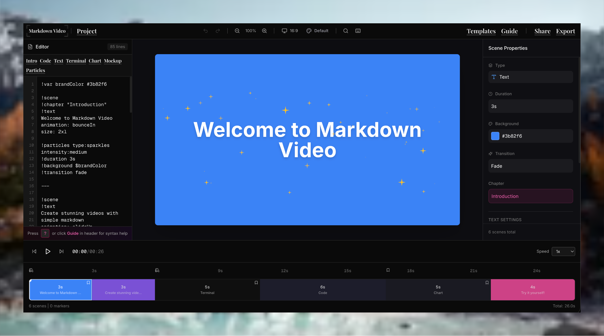

# 🎬 Markdown to Video

Transform your Markdown into stunning videos with a custom syntax that brings your content to life. Markdown to Video is a powerful Next.js-based web application that converts Markdown content into professional-quality videos with rich animations, transitions, and interactive scenes.



## ✨ Features

- **Custom Markdown Syntax**: Write videos using an intuitive extended Markdown syntax with custom directives
- **Rich Scene Types**: Support for text, code, images, terminal, diffs, charts, mockups, QR codes, countdowns, progress bars, and more
- **FFmpeg Integration**: Export videos directly to MP4 or other formats using FFmpeg
- **Real-time Preview**: See your video content as you edit it with live scene previews
- **Advanced Animations**: Multiple animation types including typewriter, slide, fade, bounce, and custom effects
- **Particle Effects**: Add confetti, snow, rain, sparkles, and fireworks to your scenes
- **Code Syntax Highlighting**: Beautiful syntax highlighting for multiple programming languages
- **Scene Transitions**: Smooth transitions between scenes (fade, slide, wipe, zoom, magic effects)
- **Terminal & Diff Support**: Render terminal commands and code diffs with syntax highlighting
- **Chart Rendering**: Create interactive charts (bar, line, pie, donut) embedded in videos
- **Video Variables**: Define and reuse variables throughout your markdown
- **Project Management**: Save and manage projects via Redis backend
- **Keyboard Shortcuts**: Boost productivity with comprehensive keyboard shortcuts
- **Find & Replace**: Quickly edit content across your markdown
- **Theme Support**: Light and dark theme with customizable color schemes
- **Responsive Design**: Fully responsive interface that works on all devices
- **Share & Embed**: Generate shareable links and embed videos

## 🏗️ Project Structure

```
app/
  ├── layout.tsx              # Root layout
  ├── page.tsx                # Landing page
  ├── editor/
  │   └── page.tsx            # Video editor interface
  ├── api/
  │   └── projects/route.ts   # API endpoint for project management
  └── globals.css
components/
  ├── landing/                # Landing page components
  ├── ui/                     # Reusable UI components (50+ Radix UI based)
  └── video-editor/
      ├── markdown-editor.tsx     # Markdown input editor
      ├── scene-preview/          # Video scene renderer
      │   ├── scenes/             # Different scene type renderers
      │   ├── components/         # Preview helpers
      │   └── utils/              # Rendering utilities
      ├── timeline.tsx            # Timeline scrubber
      ├── export-modal/           # Video export with FFmpeg
      ├── templates-panel.tsx     # Template selection
      ├── theme-selector.tsx      # Theme customization
      └── keyboard-shortcuts.tsx  # Shortcuts reference
lib/
  ├── parser/
  │   ├── index.ts            # Main markdown parser
  │   ├── parsers/            # Specialized parsers for different scenes
  │   ├── constants.ts        # Scene types and directives
  │   ├── timeline.ts         # Timeline parsing
  │   └── utils.ts            # Helper utilities
  ├── types.ts                # TypeScript type definitions
  ├── use-video-store.ts      # Zustand video state management
  ├── redis.ts                # Redis client for project persistence
  ├── github.ts               # GitHub API integration
  ├── templates.ts            # Template definitions
  └── utils.ts                # General utilities
public/
  ├── og-image.png            # Open Graph image for sharing
  └── site.webmanifest        # PWA manifest
```

## 🚀 Getting Started

### Prerequisites

- Node.js 18+ or higher
- pnpm, npm, or yarn

### Installation

1. **Clone the repository**:

   ```bash
   git clone https://github.com/Avik-creator/markdown_video.git
   cd markdown-to-video
   ```

2. **Install dependencies**:

   ```bash
   pnpm install
   ```

3. **Set up environment variables** (optional for local development):

   ```bash
   cp .env.template .env.local
   ```

4. **Run the development server**:

   ```bash
   pnpm dev
   ```

5. **Open the application**:
   Visit [http://localhost:3000](http://localhost:3000) in your browser

## 🛠️ Technologies Used

- **Framework**: [Next.js 16](https://nextjs.org/) - React framework with SSR
- **UI Components**: [Radix UI](https://www.radix-ui.com/) - Unstyled, accessible component library
- **Styling**: [Tailwind CSS 4](https://tailwindcss.com/) - Utility-first CSS framework
- **State Management**: [Zustand](https://zustand-demo.pmnd.rs/) - Lightweight state manager
- **Markdown Parsing**: Custom parser with extended syntax support
- **Video Rendering**: [FFmpeg.wasm](https://ffmpeg.org/ffmpeg.js/) - Browser-based video encoding
- **Screenshot to Canvas**: [HTML2Canvas Pro](https://html2canvas.hertzen.com/) - DOM to canvas rendering
- **Form Handling**: [React Hook Form](https://react-hook-form.com/) with Zod validation
- **Charts**: [Recharts](https://recharts.org/) - React chart library
- **Animations**: [Framer Motion](https://www.framer.com/motion/) - React animation library
- **Database**: [Upstash Redis](https://upstash.com/) - Serverless Redis for project persistence
- **Icons**: [Lucide React](https://lucide.dev/) - SVG icon library
- **Toast Notifications**: [Sonner](https://sonner.emilkowal.ski/) - Toast notification system
- **Themes**: [Next.js Themes](https://github.com/pacocoursey/next-themes) - Theme switching

## 📄 License

## 🚀 Getting Started

### Prerequisites

- Node.js 18+ or higher
- pnpm, npm, or yarn

### Installation

1. **Clone the repository**:

   ```bash
   git clone https://github.com/Avik-creator/markdown_video.git
   cd markdown-to-video
   ```

2. **Install dependencies**:

   ```bash
   pnpm install
   ```

3. **Set up environment variables** (optional for local development):

   ```bash
   cp .env.example .env.local
   ```

4. **Run the development server**:

   ```bash
   pnpm dev
   ```

5. **Open the application**:
   Visit [http://localhost:3000](http://localhost:3000) in your browser

## 📦 Available Scripts

- `pnpm dev` - Start the development server with hot reload
- `pnpm build` - Build the application for production
- `pnpm start` - Start the production server
- `pnpm lint` - Run ESLint to check code quality

## 🤝 Contributing

Contributions are welcome! To contribute:

1. Fork the repository
2. Create a feature branch (`git checkout -b feature/AmazingFeature`)
3. Commit your changes (`git commit -m 'Add some AmazingFeature'`)
4. Push to the branch (`git push origin feature/AmazingFeature`)
5. Open a Pull Request

## 📄 License

This project is licensed under the **Creative Commons Attribution-NonCommercial 4.0 International License**.

You are free to:

- ✅ Use for personal projects
- ✅ Modify and adapt the code
- ✅ Share with others (with attribution)

You are NOT allowed to:

- ❌ Use for commercial purposes
- ❌ Sell or profit from this project

For details, see the [LICENSE](LICENSE) file or visit [CC BY-NC 4.0](https://creativecommons.org/licenses/by-nc/4.0/).

## 👏 Acknowledgments

Built with amazing open-source libraries:

- [Next.js](https://nextjs.org/)
- [React](https://react.dev/)
- [Radix UI](https://www.radix-ui.com/)
- [Tailwind CSS](https://tailwindcss.com/)
- [Zustand](https://zustand-demo.pmnd.rs/)
- [FFmpeg.wasm](https://ffmpeg.org/ffmpeg.js/)
- [Framer Motion](https://www.framer.com/motion/)
- [Recharts](https://recharts.org/)

## 📧 Support

For questions, issues, or suggestions, please [open an issue](https://github.com/Avik-creator/markdown_video/issues) on GitHub.

---

Made with ❤️ by [Avik Mukherjee](https://github.com/Avik-creator)
